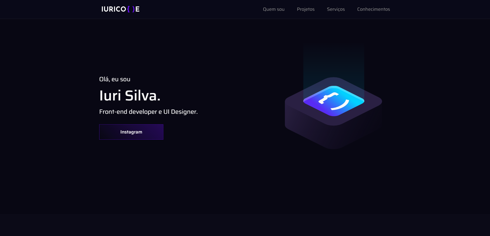

<h1 align="center">
  💻 Portafolio Katch Vidal
</h1>

<!-- 

<h4 align="center"><a href="https://www.iuricode.com/">Clique para visitar o projeto</a></h4> -->

## 📚 Secciones

Secciones:

- **Home:** ... ;
- **Quem soy:** ...;
- **Proyecto:** ...;
- **Servicios:** ...;
- **Conocimientos:** ...;

---

## 💼 Tecnologias utilizadas

Para el desarrollo de este proyecto se utilizaron las siguientes tecnologias:

- HTML;
- Sass;
- JavaScript;
- ScrollReveal;
- SVG Inject;
- Typed.js;

---

<h2>🦄 Autor</h2>

<table>
  <tr>
    <td align="center">
      <a href="https://github.com/katchvidal">
        <!--   -->
        
          <b>Katch Vidal</b>
        
      </a>
    </td>
  </tr>
</table>
